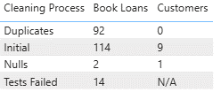
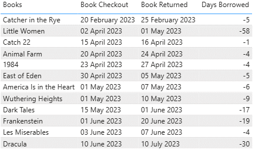
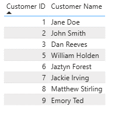
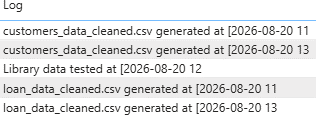

# 20260817-Module5
## Introduction

I have created a Python app which takes two datasets for a library which contains customer data and loaned book data and cleans it to remove duplicates, nulls and date errors before exporting them as csvs to be loaded into Power BI.

Here is a summary of the cleaning steps and how many rows were removed from each dataset.

## Book Loans

The book loans data was validated to confirm that the returned date was after the checkout date, if this was not the case then I exported them to a separate file. The figure below shows the books and dates which were removed from the dataset.

## Customers

There was a single customer which had no name or id, so it was removed from the set. Below is the cleaned customer list.

## Logging

When the cleaning process is run, the output files are generated and a log file is written to with a timestamp. This log file also contains information on when the data was tested.

## Output Files Summary

The pipeline takes the two source files and generates 6 files as an output, with the CSV's being replaced and the log file being added to on each run. 

loan_data_cleaned.csv - Sanitized, validated, and duration-enriched book loan data.

loan_errors.csv - Quarantined rows where loan duration logic failed (date returned was before checkout date). 

loan_data_row_counts_summary.csv - Step-by-step audit trail of row drops across the book cleaning lifecycle. 

customers_data_cleaned.csv - Cleaned and deduplicated customer records. 

customers_row_counts_summary.csv - Step-by-step audit trail of row drops across the customer cleaning lifecycle. 

log.txt - Execution timestamp log tracking successful artifact generation. 

## Next Steps - End to End Automation

This can be turned into an automated process, where files are automatically picked up from a specified location, have the process automatically triggered and then exported to an SQL database. 

The SQL database can then be linked to a Power BI dashboard wihch allows the cleaned data to be accessed, in addition to the cleaning information and when the last file ingestion, cleaning and testing was performed.